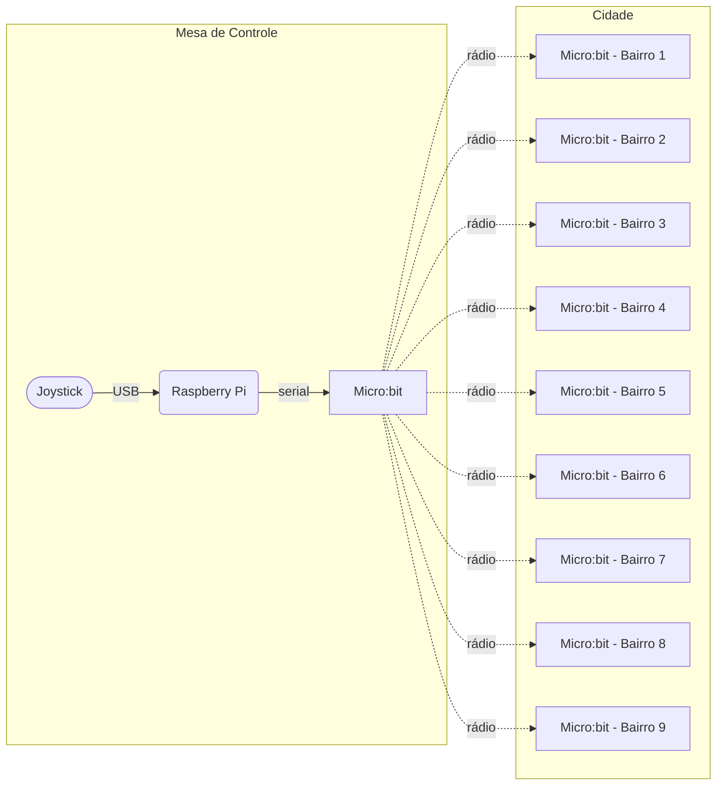

# Introdução às Telecomunicações, semestre 2022.1

Projeto de uma maquete viva feita com componentes elétricos, microcontrolados (Micro:bit versões [1.3X](https://tech.microbit.org/hardware/1-3-revision/) e [1.5](https://tech.microbit.org/hardware/1-5-revision/)) e microprocessados [Raspberry Pi modelo 3B](https://www.raspberrypi.com/products/raspberry-pi-3-model-b/):



# Código fonte

Todo o código está disponível para consulta. Para a Raspberry Pi da mesa de controle, tem o [arquivo feito em Python versão 3](https://github.com/boidacarapreta/itl20221/blob/main/mesa-de-controle.py). Para executá-lo, pode-se usar ambiente virtual (_virtual environment_):

```sh
# Criar o ambiente virtual
python3 -m venv .venv

# Carregar o ambiente virtual
. .venv/bin/activate

# Uma vez dentro do ambiente virtual, instalar as dependências
pip install -r requirements.txt 

# Por fim, executar o programa
python mesa-de-controle.py
```

Para os módulos com Micro:bit, cada um deles possui repositório próprio, o qual pode ser importado diretamente no site [Makecode](https://makecode.microbit.org):

- [Mesa de controle](https://boidacarapreta.github.io/itl20221-mesa-de-controle/)
- Bairros:
  - [5](https://boidacarapreta.github.io/itl20221-bairro-5/)
