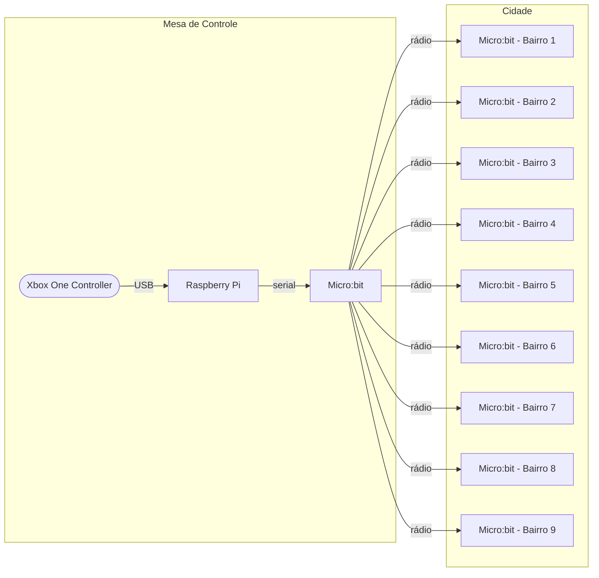

# Introdução às Telecomunicações, semestre 2022.1

Projeto de uma maquete viva feita com componentes elétricos, microcontrolados ([Micro:bit versão 1.3X](https://tech.microbit.org/hardware/1-3-revision/)) e microprocessados [Raspberry Pi modelo 3B](https://www.raspberrypi.com/products/raspberry-pi-3-model-b/).

